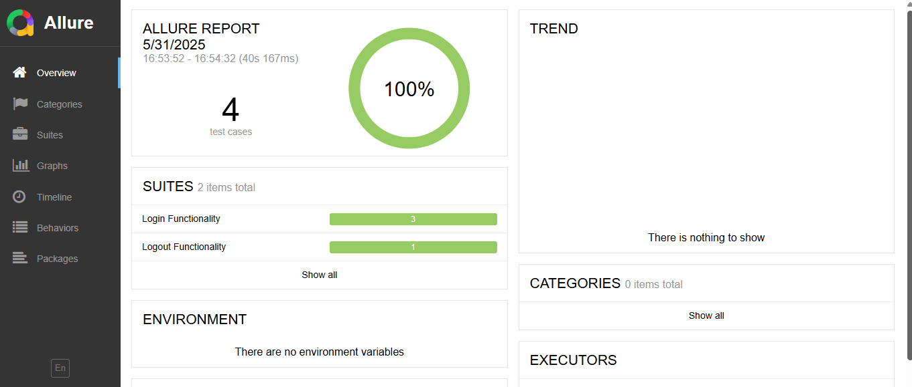
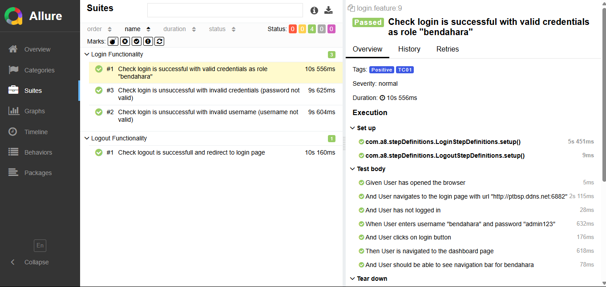

# Web Automation for Zaidan Educare Website
Proyek ini merupakan Behavior-Driven Development (BDD) test automation suite yang dirancang untuk mengotomatisasi pengujian aplikasi web "Pengelolaan Dana Pendidikan Sekolah Zaidan Educare". Dengan menggunakan teknologi seperti Java, Selenium WebDriver, Cucumber, dan JUnit, proyek ini bertujuan untuk memastikan kualitas dan fungsionalitas aplikasi melalui pengujian otomatis berbagai skenario penting seperti proses login, logout, dan verifikasi halaman dashboard.


## Author 
* Adinda Fauzia Puspita - [221524001]
* Naila Saniyyah Nuraini - [221524024]
* Rahma Divina - [221524026]

## Technologies & Tools 
* **Repository Management** : Git
* **IDE** : Visual Studio Code
* **CLI** : Command Prompt (CMD) / Powershell (Windows)
* **Web Browser** : Microsoft Edge
* **Report Generator Tools** : Allure Report
* **Build Tools** : [](https://maven.apache.org/)  
  Proyek ini menggunakan **Maven** sebagai build tool untuk manajemen dependensi dan proses build.  
  Versi Maven yang digunakan adalah **3.9.9**.  
  Informasi lebih lanjut bisa dilihat di [Kunjungi situs Maven](https://maven.apache.org/).

* **Programming Language** : [](https://www.java.com/)

  Versi Java yang kami gunakan adalah Java 21.0.6 2025-01-21 LTS. 
  Untuk informasi lebih lanjut -> [Kunjungi situs Java](https://www.java.com/).

* **Unit Testing** : [](https://junit.org/)

  JUnit membantu kami untuk membuat test script dan menjalankan unit test dalam proyek Java. 
  Versi JUnit yang digunakan adalah JUnit Jupiter 5.12.2. 
  Untuk informasi lebih lanjut -> [Kunjungi situs JUnit](https://junit.org/).

### Test Features
1. Pengujian web otomatis menggunakan Selenium
2. Skenario pengujian gaya BDD yang ditulis dalam bahasa Gherkin (Cucumber)
3. Page Object Model untuk interaksi UI yang mudah dipelihara dan dapat digunakan ulang
4. Integrasi dengan Allure Report untuk hasil pengujian yang informatif

### Tested Web Features
1. Login
    -  Login berhasil dengan kredensial valid
    -  Login gagal dengan username tidak valid
    -  Login gagal dengan password tidak valid
2. Logout
    -  Logout berhasil 

## Getting Started 
### How To Use
1. Lakukan instalasi Java JDK min versi 21 atau versi terbarunya (disarankan menggunakan versi 17 atau 21) pada halaman (https://www.oracle.com/id/java/technologies/downloads/) .
2. Lakukan instalasi Maven (disarankan menggunakan versi 3.9.9) pada halaman (https://maven.apache.org/download.cgi).
3. Pastikan instalasi tersebut berhasil.
4. Tambahkan Java dan Maven dengan melakukan set environment variables pada desktop anda.
5. Pastikan Java dan Maven dapat digunakan pada perangkat anda dengan mengetikkan 'java --version' dan 'mvn --v'.
6. Jika sudah berhasil, clone repository ini ke perangkat anda dengan cara:
```
git clone https://github.com/NailaSaniyyahh/WebAutomationTesting-PPLPraktek.git
```
7. Open project yang telah di clone menggunakan IDE favorit Anda.

### How To Push Your Change
Untuk melakukan push setiap kali terdapat update atau perubahan kode anda, lakukan dengan step berikut : 
*Notes* Pastikan untuk selalu menjalankan perintah 'git pull' terlebih dahulu saat ingin melakukan perubahan.

1. Tambahkan file yang telah diubah 
```
git add .
```
2. Commit file yang ditambahkan menggunakan keterangan singkat setelah command -m 
```
git commit -m "keterangan singkat terhadap perubahan anda"
```
3. Lalu push commit anda ke repository 
```
git push 
```

### Script For Testing Program   
Junit
```
mvn clean test
```

### Generate Report
Setelah melakukan command untuk testing program zaidan educare, hasil dan laporan testing tersebut akan di-generate dan disimpan pada lokasi :
```
WebAutomationTesting-PPLPraktek\docs\index.html
```

### Test Report 
Adapun Hasil dari pengujian sebagai berikut:



Selain itu, terdapat detail list skenario yang dijalankan. Misalnya pada skenario Check login is successful with valid credentials as role "bendahara" seperti berikut:


## Framework & Library Used
Kami menggunakan beberapa dependency yang digunakan untuk menunjang kebutuhan program kami untuk dapat dijalankan dengan baik, Dependency tersebut antara lain : 
1. *org.seleniumhq.selenium * 
    - Untuk mengotomasi interaksi dengan web browser seperti klik tombol, cek elemen, dst yang nantinya akan digunakan oleh file-file actions untuk mengambil dan mengendalikan elemen halaman pada web. 
2. *io.github.bonigarcia* 
    - Untuk setup driver secara otomatis tanpa harus mendownload driver, digunakan pada DriverManager class untuk inisialisasi driver.
2. *Cucumber* 
    - Untuk mengimplementasikan cucumber dan integrasinya dengan JUnit 5.
2. *Allure Report* 
    - Sebagai generate test report tools dalam format HTML yang menampilkan status setiap scenario, durasi eksekusi dan detail error ketika test case fail